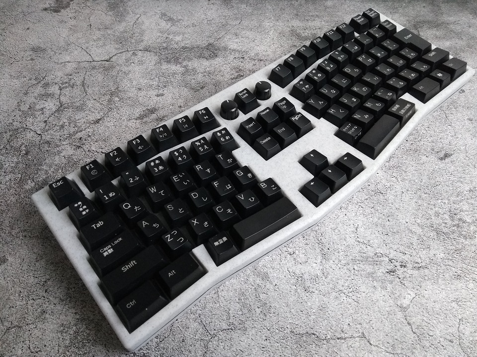
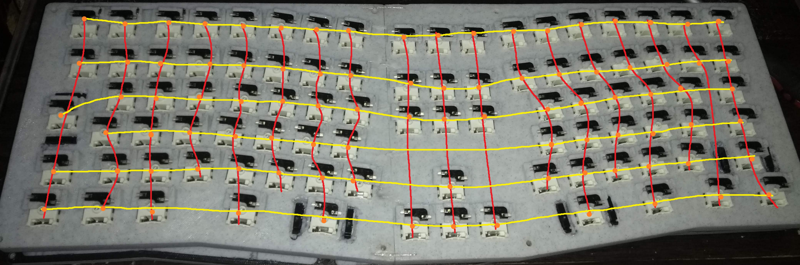

# Kusuguru

An 3D printable Alice-like JIS-layout TKL mechanical keyboard

## Layout

[Keyboard Layout Editor](http://www.keyboard-layout-editor.com/#/gists/484f5ee0a52b16d75605850b4b710184)

## Components

### Required components

- 93× switches of your choice
- 4× plate-mounted Costar stabilizers
- 93× diodes
- Wires
- 8× M3×16 countersunk screws

### Optional components

- 1× M3×16 countersunk screw
- 1× M3×25 countersunk screw
- 3D printed spacers
- 93x Kailh hotswap sockets
- 3D printed kailh hotswap socket holders (modified from ["Cherry MX Kailh Socket Holder" by peterlee, licensed CC BY 3.0](https://www.thingiverse.com/thing:3117549))
- [DFRobot EC11 rotary encoder modules](https://www.dfrobot.com/product-1611.html)
- M3×8 countersunk screws

The optional long screws are for reinforcing the top left and right halves. The short screws are for mounting encoder module(s) if needed.

You may opt for hotswap using Kailh sockets. You'd need to 3D print the accent spacers as well. I just superglued all the hotswap socket holders to the case.

## Wiring diagram

## Build notes

The halves do not lock into each other. I used a combination of glue and diode trimmings melted into the plastic.

For gluing things together, I found [this](https://www.youtube.com/watch?v=n1meoZaHYZo) video about using super glue and baking soda about the process.

## Firmware

The firmware included is for the STM32F103 ["Blue Pill"](https://wiki.stm32duino.com/index.php?title=Blue_Pill) board.

The STM32duino bootloader is not necessary. Simply flash the board using an ST-Link programmer.

## More info

More info can be found in [this blog post](https://ramonimbao.github.io/kusuguru/).

## License

This project is licensed under the MIT license. See the `LICENSE.md` for more details.